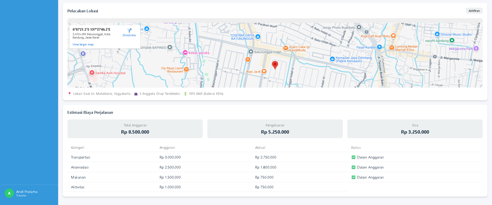

# 🌟 TravelEase - AI Travel Management System

<div align="center">

**An intelligent travel management platform combining Laravel 11 with AI-powered assistance**


[](https://php.net/)
[](https://laravel.com/)
[](https://python.org/)
[](https://flask.palletsprojects.com/)
[](https://ai.google.dev/)

</div>

---

## 🎯 Project Overview

TravelEase adalah sistem manajemen perjalanan berbasis AI yang menggabungkan teknologi web modern dengan kecerdasan buatan untuk memberikan pengalaman travel planning yang seamless dan personal.

### 🏗️ Architecture Highlights

```mermaid
graph TB
    A[🌐 Laravel Frontend] --> B[📡 HTTP API]
    B --> C[🐍 Flask Backend]
    C --> D[🤖 Google Gemini AI]
    C --> E[📊 Travel Dataset]
    A --> F[🗺️ Maps Integration]
    A --> G[💾 SQLite Database]
```

<div align="center">



</div>

### 📁 Project Structure

- **`Maps/`**: Aplikasi web Laravel 11 (frontend dan API)
- **`TravelEase/`**: Backend Python dengan Flask API dan integrasi Gemini AI

---

## ✨ Key Features

<table>
<tr>
<td width="50%">

### 🎫 **Travel Management**
- Interactive travel package booking
- Route planning & navigation
- Cost estimation tools
- Travel history tracking

### 🤖 **AI-Powered Assistant**
- Natural language travel queries
- Personalized recommendations
- Indonesian language support
- Context-aware responses

</td>
<td width="50%">



### 📱 **Additional Features**
- 🗺️ Travel location management
- 🤖 AI-powered travel assistant (Gemini)
- 📱 Responsive mobile design
- 🎫 Travel package booking
- 📍 Location-based services

</td>
</tr>
</table>

---

## 🏞️ Featured Destinations

<div align="center">

| 🏛️ Yogyakarta | 🏝️ Bali | 🌋 Lombok | 🐉 Labuan Bajo |
|:---:|:---:|:---:|:---:|
|  |  |  |  |
| Historic Cultural Hub | Tropical Paradise | Adventure Island | Dragon Island Gateway |

</div>

### 🗺️ Premium Travel Packages

<div align="center">


</div>

**Available Routes:**
- 🚌 Jakarta ↔ Yogyakarta (3D2N) - *from Rp 850K*
- ✈️ Jakarta ↔ Bali (4D3N) - *from Rp 1.8M*  
- 🏔️ Bali ↔ Lombok (3D2N) - *from Rp 1.2M*
- 🌊 Lombok ↔ Labuan Bajo (5D4N) - *from Rp 2.5M*

</div>

---

## 🛠️ Tech Stack

<div align="center">

### Frontend & Backend


### AI & Data Processing


### Database & Tools


</div>

---

## 🚀 Quick Start

### Prerequisites
- PHP 8.2+
- Python 3.11+
- Composer
- XAMPP atau web server lainnya

### Installation

<details>
<summary><b>🔧 Setup Instructions</b></summary>

#### 1. Laravel Setup (Maps/)
```bash
cd Maps
composer install
cp .env.example .env
php artisan key:generate
php artisan migrate
php artisan serve
```

#### 2. Python Setup (TravelEase/)
```bash
cd TravelEase
# Install dependencies via Jupyter notebook atau manual:
pip install transformers torch PyPDF2 pandas datasets google-generativeai requests flask python-dotenv
```

#### 3. Environment Configuration
**PowerShell (temporary):**
```powershell
$env:GEMINI_API_KEY = "your-api-key-here"
```

**Atau buat file `.env` di TravelEase/:**
```
GEMINI_API_KEY=your-api-key-here
GEMINI_MODEL=gemini-2.5-pro
```

#### 4. Running the Application
1. **Start Laravel (terminal 1):**
```bash
cd Maps
php artisan serve
```

2. **Start Python Flask API (terminal 2):**
```bash
cd TravelEase
python TravelAPI.py
```

3. **Access:** http://127.0.0.1:8000

</details>

### API Integration
Laravel berkomunikasi dengan Flask server via HTTP:
- **Flask Endpoint**: `http://127.0.0.1:5000/chat`
- **Method**: POST
- **Data**: JSON dengan field `query`

### Security Notes
- **JANGAN** commit file `.env` ke Git
- API keys disimpan di environment variables
- Database menggunakan SQLite untuk development

---

## 🎨 User Interface Showcase

<div align="center">

### 💬 AI Chatbot Interface


### 🗺️ Route Planning


### 📊 Travel Dashboard


</div>

---

## 🤖 AI Integration

### Intelligent Travel Assistant

```python
# TravelEase/TravelGPT.py - Core AI Logic
class ChatGenerator:
    def __init__(self, gemini_api_key: str):
        genai.configure(api_key=gemini_api_key)
        self.model = genai.GenerativeModel(
            "gemini-2.5-pro",
            system_instruction="Travel assistant with Indonesian language support"
        )
```

**AI Features:**
- 🧠 Context-aware responses using travel dataset
- 🇮🇩 Native Indonesian language processing
- 💬 Natural conversation flow
- ⚡ Real-time query processing

---

##  Why This Project?

<div align="center">

### 💡 **Innovation Highlights**

</div>

<table>
<tr>
<td width="30%">
<div align="center">

**🔄 Dual-Stack Architecture**

Seamless integration between Laravel web framework and Python AI backend

</div>
</td>
<td width="30%">
<div align="center">

**🤖 AI-First Approach**

Context-aware travel assistant using Google's latest Gemini AI

</div>
</td>
<td width="30%">
<div align="center">

**🇮🇩 Localized Experience**

Full Indonesian language support with cultural context

</div>
</td>
</tr>
</table>

### 📊 Project Metrics
- 🏗️ **Architecture**: Dual-stack (Laravel + Python)
- 🌐 **Routes**: 12+ web routes with Indonesian naming
- 🎨 **Views**: 15+ Blade templates with inline styling
- 🤖 **AI Integration**: Google Gemini 2.5 Pro
- 📦 **Travel Packages**: 5+ destination combinations

---

## 🚀 Future Roadmap

- [ ] 📱 **Mobile App Development** (Flutter/React Native)
- [ ] 💳 **Payment Gateway Integration**
- [ ] 📍 **Real-time Location Tracking**
- [ ] 🔔 **Push Notifications**
- [ ] 📈 **Analytics Dashboard**
- [ ] 🌍 **Multi-language Support**

---

## 👨‍💻 About Developer

<div align="center">

**Sabilillah Ramaniya Widodo** ([@sblrm](https://github.com/sblrm))

*Aspiring Full-Stack Developer | AI Enthusiast | Travel Technology Innovator*

[](https://github.com/sblrm)

[](https://github.com/sblrm)

[](https://github.com/sblrm)
[](mailto:sabilillah.widodo@binus.ac.id)
[](https://linkedin.com/in/sblrm)

### 💼 **Seeking Internship Opportunities**
*Full-Stack Development | AI Integration | Travel Technology*

### 🌟 **Star this repository if you found it interesting!**

**Built with ❤️ by Sabilillah Ramaniya Widodo**

*Combining passion for travel with cutting-edge technology*

[](https://github.com/sblrm)

</div>

---

## 📄 License

All rights reserved by Sabilillah Ramaniya Widodo.
